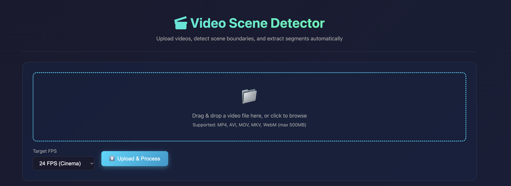
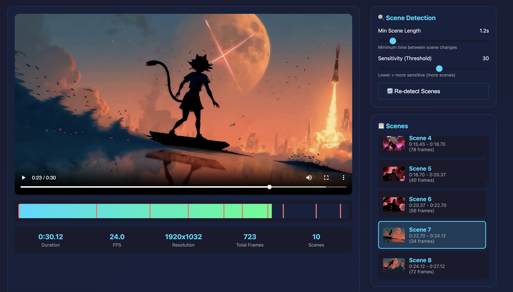
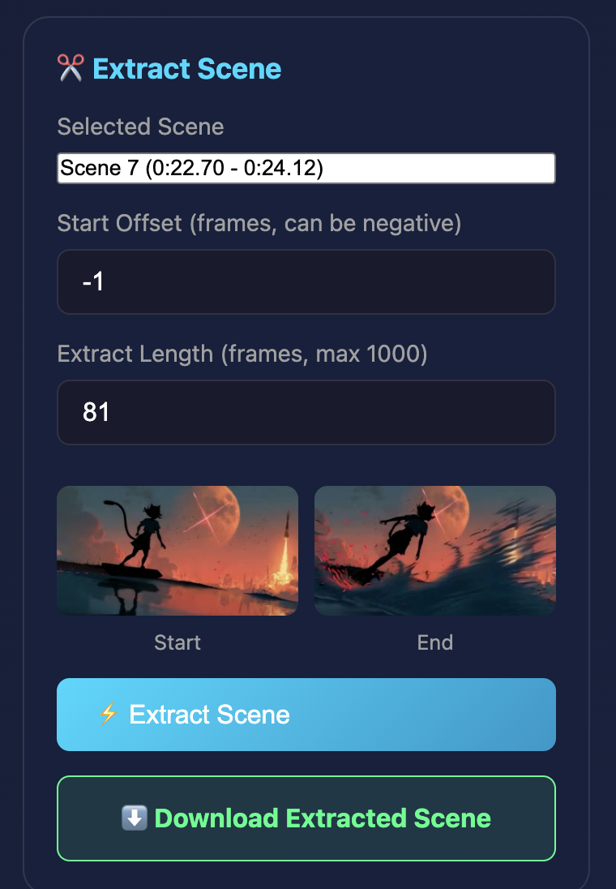

# Video Scene Detector

A web-based video scene detection and extraction application that automatically identifies scene boundaries in videos and allows extracting specific segments.


## Features

- **Video Upload & Processing** - Upload videos up to 500MB (MP4, AVI, MOV, MKV, WebM)
- **Automatic Re-encoding** - Standardizes videos to target frame rates (16, 24, 25, or 30 fps)
- **Scene Detection** - Uses machine learning (pyscenedetect) to identify scene boundaries
- **Scene Extraction** - Extract specific video segments by frame range
- **Preview Generation** - Generate frame thumbnails at any timestamp
- **Interactive UI** - Web interface with video player, scene timeline, and extraction controls

## Tech Stack

- **Backend**: Node.js + Express.js
- **Video Processing**: FFmpeg + fluent-ffmpeg
- **Scene Detection**: Python + pyscenedetect
- **File Uploads**: Multer
- **Frontend**: Vanilla JavaScript + HTML5 Video Player

## Prerequisites

- Node.js >= 18.0.0
- FFmpeg (with ffprobe)
- Python 3.x with pyscenedetect

### Installing FFmpeg

**macOS:**
```bash
brew install ffmpeg
```

**Ubuntu/Debian:**
```bash
sudo apt update
sudo apt install ffmpeg
```

**Windows:**
Download from https://ffmpeg.org/download.html and add to PATH

### Installing Python Dependencies

```bash
pip install scenedetect
```

## Installation

### Quick Install (Recommended)

Run the install script to automatically install all dependencies:

```bash
chmod +x install.sh
./install.sh
```

This script will:
- Check for Node.js >= 18.0.0
- Install FFmpeg (macOS via Homebrew, Linux via apt/yum)
- Install Python dependencies (pyscenedetect)
- Install Node.js packages
- Create required directories

### Manual Installation

1. Clone the repository:
```bash
git clone <repository-url>
cd video-scene-detector
```

2. Install FFmpeg:
   - **macOS:** `brew install ffmpeg`
   - **Ubuntu/Debian:** `sudo apt install ffmpeg`
   - **Windows:** Download from https://ffmpeg.org/download.html

3. Install Python dependencies:
```bash
pip install scenedetect
```

4. Install Node.js dependencies:
```bash
npm install
```

5. Create required directories:
```bash
mkdir -p uploads outputs
```

## Usage

### Start the Server

Development mode (with auto-reload):
```bash
npm run dev
```

Production mode:
```bash
npm start
```

The server will start on `http://localhost:5000`

### Using the Web Interface

1. Open `http://localhost:5000` in your browser
2. Select target FPS and upload a video file
3. Wait for processing (video is re-encoded and scenes are detected)
4. Browse detected scenes in the sidebar or timeline
5. Select a scene and adjust extraction parameters
6. Click "Extract Scene" to download the segment

## Screenshots

### Video Uploader
Upload videos with configurable target FPS settings.



### Scene Selector
Browse and select detected scenes from the sidebar with thumbnail previews.



### Scene Extractor
Extract specific video segments with frame-accurate controls and preview thumbnails.



## API Endpoints

| Endpoint | Method | Description |
|----------|--------|-------------|
| `/` | GET | Serve main application UI |
| `/upload` | POST | Upload video, re-encode, detect initial scenes |
| `/detect-scenes` | POST | Re-detect scenes with different parameters |
| `/extract` | POST | Extract scene segment to MP4 |
| `/download/<filename>` | GET | Download extracted scene file |
| `/preview` | GET/POST | Generate frame thumbnail at timestamp |
| `/preview_image/<filename>` | GET | Serve preview thumbnail image |
| `/video/<filename>` | GET | Stream uploaded/re-encoded video |

### Example API Requests

#### Upload Video
```bash
curl -X POST -F "file=@video.mp4" -F "target_fps=24" http://localhost:5000/upload
```

#### Detect Scenes
```bash
curl -X POST -H "Content-Type: application/json" \
  -d '{"filepath":"/uploads/video.mp4","minSceneLength":2}' \
  http://localhost:5000/detect-scenes
```

#### Extract Scene
```bash
curl -X POST -H "Content-Type: application/json" \
  -d '{"filepath":"/uploads/video.mp4","start_frame":100,"end_frame":340,"fps":24}' \
  http://localhost:5000/extract
```

## Project Structure

```
video-scene-detector/
├── server.js                 # Express app entry point
├── package.json
├── routes/
│   ├── upload.js            # Upload and re-encode endpoint
│   ├── scenes.js            # Scene detection endpoint
│   ├── extract.js           # Scene extraction endpoint
│   └── preview.js           # Thumbnail generation endpoint
├── services/
│   ├── ffmpeg.js            # FFmpeg/ffprobe wrapper
│   ├── sceneDetector.js     # Scene detection logic (Python integration)
│   ├── scene_detector.py    # Python script for pyscenedetect
│   └── fileManager.js       # File storage utilities
├── public/
│   └── index.html           # Frontend web interface
├── uploads/                 # Uploaded/re-encoded videos
└── outputs/                 # Extracted scene segments
```

## Video Processing Specifications

### Re-encoding Parameters

| Parameter | H.264 (≤1080p) | H.265 (>1080p) |
|-----------|----------------|----------------|
| Codec | libx264 | libx265 |
| CRF | 18 | 23 |
| Preset | fast | fast |
| Audio | AAC @ 192k | AAC @ 192k |

### Scene Detection

- Uses pyscenedetect's ContentDetector algorithm
- Configurable minimum scene length (0.5 - 60 seconds)
- Threshold: 20 (lower = more sensitive, range 0-255)
- Returns start/end frame numbers and timestamps

### Scene Extraction

- Fast copy codec extraction (no re-encoding)
- MP4 output format
- Supports frame-accurate extraction

## Environment Variables

| Variable | Default | Description |
|----------|---------|-------------|
| `PORT` | 5000 | Server port |
| `UPLOAD_FOLDER` | ./uploads | Upload storage path |
| `OUTPUT_FOLDER` | ./outputs | Extracted scenes path |
| `MAX_FILE_SIZE` | 524288000 | Max upload size in bytes (500MB) |

## Configuration

Edit the following constants in the service files:

**services/fileManager.js:**
```javascript
const ALLOWED_EXTENSIONS = ['mp4', 'avi', 'mov', 'mkv', 'webm'];
const TARGET_FPS_OPTIONS = [16, 24, 25, 30];
```

**services/sceneDetector.js:**
```javascript
const DEFAULT_MIN_SCENE_LENGTH = 1.0; // seconds
const DEFAULT_THRESHOLD = 20.0; // 0-255, lower = more sensitive
```

## Error Handling

The API returns JSON error responses:

```json
{
  "error": "Description of the error"
}
```

Common error codes:
- `400` - Bad request (invalid file, missing parameters)
- `413` - File too large
- `404` - File not found
- `500` - Internal server error

## Security Features

- File extension whitelist validation
- UUID-based filenames (original names hidden)
- Path traversal protection
- File size limits
- Secure path validation

## Browser Compatibility

- Chrome/Edge 80+
- Firefox 75+
- Safari 13+

Requires support for:
- HTML5 Video element
- Fetch API
- CSS Grid/Flexbox

## Troubleshooting

### FFmpeg not found
Ensure FFmpeg is installed and accessible in your system PATH.

### Python/scenedetect not found
Install pyscenedetect: `pip install scenedetect`

### Upload fails
Check file size (max 500MB) and format (MP4, AVI, MOV, MKV, WebM).

### Scene detection fails
Ensure Python 3.x and pyscenedetect are properly installed.

## License

MIT License - see LICENSE file for details

## Credits

- Scene detection powered by [pyscenedetect](https://github.com/Breakthrough/PySceneDetect)
- Video processing powered by [FFmpeg](https://ffmpeg.org/)
- Web framework: [Express.js](https://expressjs.com/)
